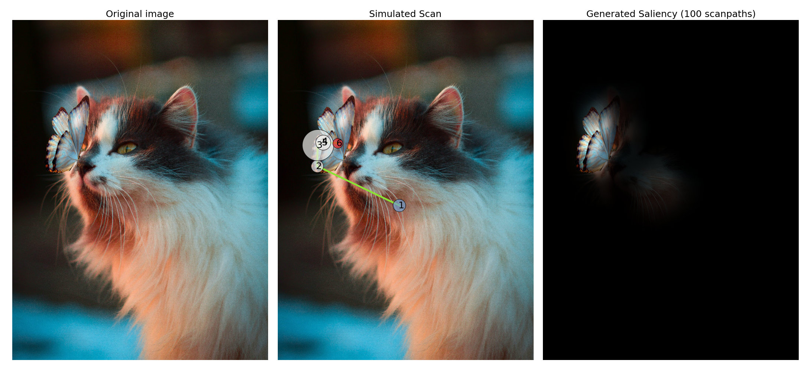

# ScanDDM: Generalised Zero-Shot Neuro-Dynamical Modelling of Goal-Directed Attention

Implementation of the **scanDDM** model presented in the paper "ScanDDM: Generalised Zero-Shot Neuro-Dynamical Modelling of Goal-Directed Attention (ECCVW 2024)". 

It models goal-directed attention by integrating high-level abstract concepts provided through arbitrary textual prompts. The approach relies on a multialternative Drift Diffusion Model (DDM), framing gaze dynamics as a decision-making process that encapsulates both fixation duration and saccade execution. This allows to implement a value-based evidence accumulation process akin to the neurobiological mechanisms surmised to underlie human perceptual decision making.

The following depicts an example simulation from the model. The provided goal is "Something to drink".


## Dependencies

You can install all the requirements with `pip install -r requirements.txt`
The project has been developed using `Python 3.9` and `Pytorch 2.3`.


## Basic Usage

You can just run `python main.py`. 

An example output is shown below on an arbitrary image. The prompt used is: *"delicate"*.



## Citation

Please cite with the following BibTeX:
```
@inproceedings{damelio2024scanddm,
  title={{ScanDDM: Generalised Zero-Shot Neuro-Dynamical Modelling of Goal-Directed Attention}},
  author={D'Amelio, Alessandro and Lucchi, Manuele and Boccignone, Giuseppe},
  booktitle={Proceedings of the European Conference on Computer Vision},
  year={2024}
}
```
